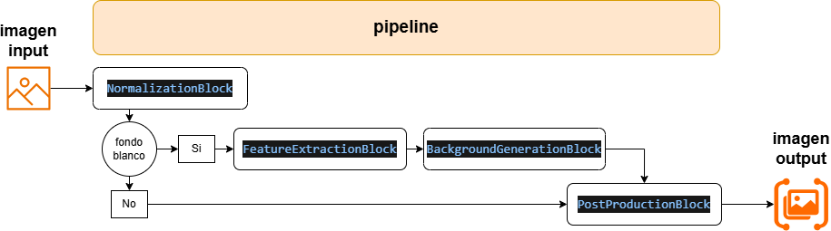

# Generación de Fondos para Imágenes de Productos

Este proyecto implementa un pipeline para generar y reemplazar automáticamente fondos en imágenes de productos, especialmente diseñada para aplicaciones de comercio electrónico. Utiliza una arquitectura de pipeline que procesa imágenes a través de varias etapas: normalización, extracción de características, generación de fondos y post-producción.
Tambien expone una API para interactuar con el pipeline.



---
Usa el playground en [https://photo-magic-flow.onrender.com/](https://photo-magic-flow.onrender.com/) para probar el pipeline.
---

## Descripción General

La API de Generación de Fondos procesa imágenes de productos mediante un pipeline de múltiples etapas:

1. **Normalización**: Detecta si la imagen tiene un fondo blanco y extrae propiedades básicas.
2. **Extracción de Características**: Analiza la orientación y características del producto.
3. **Generación de Fondos**: Crea una máscara del producto y genera nuevos fondos.
4. **Post-Producción**: Finaliza la imagen aplicando un upscaler para mejorar la resolución de la imagen..

---

## Instalación

### Requisitos Previos

- Python 3.10+
- Paquetes Python requeridos (instalar con `pip install -r requirements.txt`)

### Configuración

1. Clona el repositorio:
    ```bash
    git clone https://github.com/Crismarquez/demo-backgroundgen.git
    cd demo-backgroundgen
    ```
2. Instala las dependencias:
    ```bash
    pip install -r requirements.txt
    ```
3. Configura las variables de entorno:
    - Crea un archivo `.env` con las variables relacionadas.

---

## Uso

### Ejecutando el Script de Pipeline

Para procesamiento por lotes o pruebas, ejecuta:

```bash
python scripts/run_pipeline.py
```
Este script procesa imágenes de muestra del directorio data/samples y guarda los resultados en un directorio de ejecución específico data/runs_inference.

### Ejecutando el Servidor API

Inicia el servidor FastAPI:
```bash
uvicorn main:app --host 0.0.0.0 --port 5000
```

El servidor estará disponible en: [http://localhost:5000](http://localhost:5000)

## Endpoints de la API

- **POST /photography/background**: Procesa una imagen para generar un nuevo fondo.
  - **Cuerpo de la solicitud**: JSON con el campo `image_b64` que contiene una imagen codificada en base64.
  - **Respuesta**: Respuesta en *streaming* con resultados paso a paso.

---


## Estructura del Repositorio
```bash
src/
│
├── blocks.py        # Bloques de procesamiento individuales (normalización, características, etc.)
├── pipelines.py     # Orquestación del pipeline completo
├── utils.py         # Funciones de utilidad para procesamiento de imágenes
├── prompt.py        # Plantillas de prompts para interacciones con LLM
├── routers/         # Definiciones de rutas de la API
├── config/          # Archivos de configuración
scripts/             # Scripts de utilidad para ejecución manual
data/                # Directorio de datos: muestras y resultados
```

## Detalles Técnicos

El pipeline combina técnicas de procesamiento de imagenes y modelos generativos:

- **GPT-4o** (OpenAI): Utilizado para el análisis descriptivo de productos y generación de prompts adaptativos.
- **Orient-Anything** (Hugging Face): Modelo especializado en detectar la orientación espacial de objetos en imágenes.
- **evf-sam2** Modelo de segmentación de imágenes basado en SAM.
- **flux inpainting**  Modelo de inpainting de imágenes.
- **GrabCut** (OpenCV): Algoritmo clásico de segmentación para generar máscaras de fondo precisas alrededor del producto.
